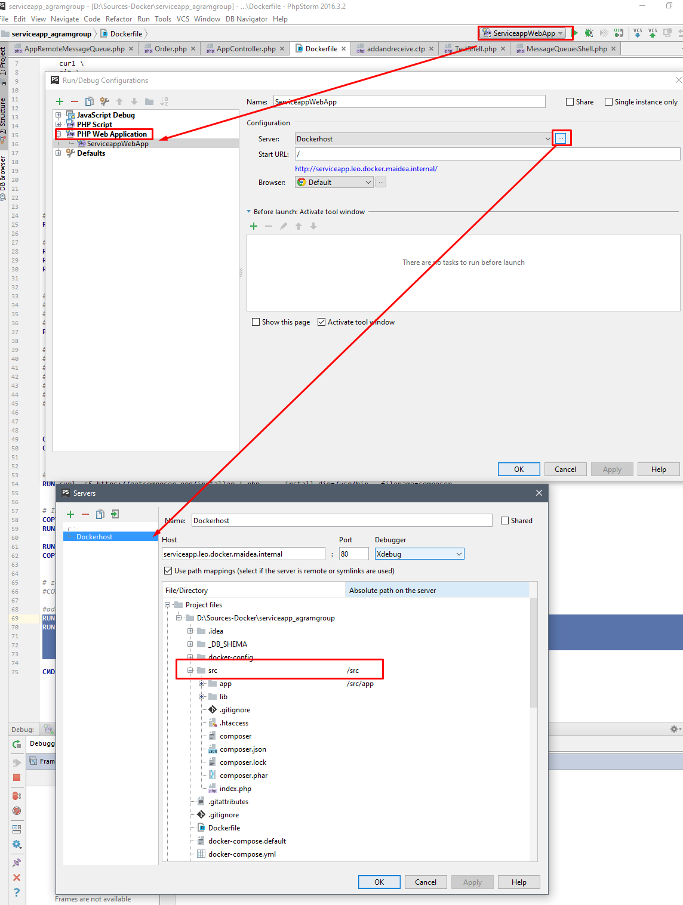

# maidea_webserver
Nginx, Php-fpm and wkhtml container for simple docker dev/test environments
- for use with CakePhp
- dev branch has Xdebug


TODO: propper readme

####Version 1:
nginx root is set to */src/app/webroot*

using compose:
```yaml
webserver:
  image: maidea/webserver:1
  volumes:
   - "./src:/src"
  environment:
    #for use witn jwilder/nginx-proxy
   - VIRTUAL_HOST=host.example.com
  expose:
   - "80"
  container_name: webserver1
  ```


####Version 2:

nginx root is set to */app/webroot*

using compose:
```yaml
webserver:
  image: maidea/webserver:2
  volumes:
   - "./src/app:/app"
  environment:
    #for use witn jwilder/nginx-proxy
   - VIRTUAL_HOST=host.example.com
  expose:
   - "80"
  container_name: webserver1
  ```


####Version dev:

nginx root is set to */app/webroot*

Xdebug is enabled and configured to connect to remote client

using compose:
```yaml
webserver:
  image: maidea/webserver:dev
  volumes:
   - "./src/app:/app"
  environment:
    #for use witn jwilder/nginx-proxy
   - VIRTUAL_HOST=host.example.com
   #set to dev (IDE) client IP
   - XDEBUG_HOST=192.168.200.300
   #name of server configuration in phpstorm
   - PHP_IDE_CONFIG=serverName=Dockerhost
  expose:
   - "80"
  container_name: webserver1
  ```


Phpstorm configuration needs to be Web-application, and folders need to be mapped:

